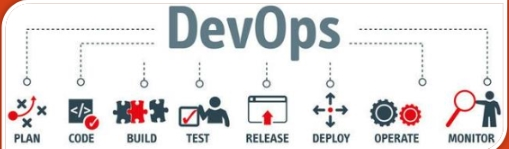

A figura descreve um fluxo típico de DevOps que inclui as etapas de **planejamento, codificação, construção, teste, lançamento, implantação, operação e monitoramento**. Cada uma dessas etapas deve incluir processos para garantir a qualidade do software.

Segue uma análise baseada no conteúdo e boas práticas mencionadas:  

---

## **8.1 - Boas Práticas para Garantir a Qualidade de Software**

### **Processos com Garantias**
É essencial que cada etapa do desenvolvimento inclua mecanismos de validação para:
1. **Prevenir Erros:** Aplicando verificações antecipadas, seguindo o conceito de **Shift Left Testing**.
2. **Identificar Impedimentos:** Validando cada fase do ciclo para reduzir retrabalho.

---

### **Boas Práticas Recomendadas:**
1. **Documentação de Requisitos:**
   - Garantir clareza sobre o que será desenvolvido.
2. **Correção de Código:**
   - Revisar e corrigir os problemas detectados o mais cedo possível.
3. **Testes Unitários (TDD):**
   - Desenvolver testes antes do código, aumentando a confiabilidade.
4. **Code Reviews:**
   - Validar a qualidade do código em equipe.
5. **Análise de Estatísticas:**
   - Medir e acompanhar métricas de qualidade, como cobertura de testes.
6. **Sistema de Builds / Integração Contínua (CI/CD):**
   - Automatizar builds e implantações para manter entregas rápidas e consistentes.
7. **Testes Funcionais:**
   - Garantir que funcionalidades atendem aos requisitos do usuário.
8. **Plano de Testes (BDD):**
   - Escrever cenários baseados em comportamento do usuário final.
9. **Testes Automatizados:**
   - Reduzir erros manuais e aumentar a repetibilidade.
10. **Testes de Carga e Performance:**
    - Avaliar a capacidade do sistema sob diferentes condições.

---

### **Entrega Contínua e DevOps**
A imagem ilustra uma visão técnica de um ciclo DevOps, incluindo:
1. **Planejar:** Identificar requisitos e prioridades.
2. **Codificar:** Garantir qualidade desde o início.
3. **Construir:** Validar integrações antes de testar.
4. **Testar:** Automação para eficiência e confiabilidade.
5. **Lançar:** Planejamento cuidadoso de entregas.
6. **Implantar:** Processos seguros e monitorados.
7. **Operar e Monitorar:** Identificar problemas em tempo real para melhoria contínua.

Essa abordagem reflete o alinhamento entre equipes e o uso de ferramentas de gerenciamento, como Azure DevOps ou GitHub Actions, que suportam a automação em cada fase do pipeline.  

